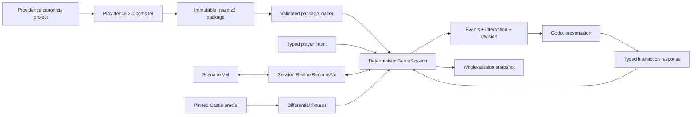

# Architecture

Realmz Remake 2.0 is a deterministic Realmz engine hosted by Godot, not a Godot-shaped RPG framework. Providence compiles canonical authoring projects into immutable packages. The runtime validates a package, constructs typed Realmz content, and gives one `GameSession` complete ownership of mutable playthrough state.

## Layer ownership

`src/core` owns direct Realmz models, fixed Classic rules, topology, clock, RNG, and the session aggregate. It is pure typed GDScript: no Nodes, scenes, autoloads, time, files, audio, OS calls, or Godot RNG.

`src/scenario` owns the serializable VM and Scenario Action language. It asks a session-owned `RealmzRuntimeApi` for domain operations. The VM cannot discover Godot or call arbitrary scripts.

`src/infrastructure` owns untrusted package/save bytes, schema and hash validation, typed construction, persistence, migrations, and installed-content discovery.

`src/app` constructs dependencies and translates host operations. It may replace a session only after a complete restore has validated.

`src/presentation` reads `GameView` and ordered domain events, renders disposable caches, and sends typed intents/responses. Animation never controls simulation timing.

## Session boundary

The public session protocol is:

- `start(content, seed) -> SessionStep`
- `restore(content, save_envelope) -> SessionStep`
- `submit_intent(player_intent) -> SessionStep`
- `respond(interaction_response) -> SessionStep`
- `view() -> GameView`
- `snapshot() -> SaveEnvelope`

Mutations are synchronous. A step contains committed ordered events, an optional serializable interaction request, a view revision, and an explicit completed/waiting/failed state. Presentation waits for animations on its own; the session waits only for genuine player or operating-system input.

## Fixed rules and direct model

The engine models Realmz concepts—party, characters, maps, APs/XAPs, encounters, battles, shops, treasures, spells, items, monsters, races, and castes—rather than translating them into generic RPG resources. `RealmzRules` is always present and has no provider registry or compatibility selector. A narrow named legacy quirk exists only when authored content demonstrably needs it.

## Topology

`MapTopology` and `WorldState` overlays are authoritative. Providence normalizes land cells, packed dungeon fields, and Layout adjacency into cells with explicit directional edges/features, random regions, and transitions. Movement, LOS, deterministic pathfinding, searches, triggers, random encounters, battle-terrain derivation, minimaps, 2D views, and later 3D views ask that same query surface. TileMaps, collisions, AStar graphs, textures, and meshes are presentation caches and cannot answer simulation questions. See `docs/topology-evidence.md` for the Castle evidence boundary and Phase 2 proofs.

## Scenario execution

Classic instructions retain opcode identity and provenance. AP/Encounter timelines may also call reusable typed Scenario Actions. Safe Actions compile to bounded programs and execute in the same serializable VM. Core operations cannot be overridden. GDScript is not a fallback; a later GDScript backend must use an OS-confined external process and the same JSON-safe Scenario Action ABI.

## Persistence and randomness

One `.r2save` envelope contains all mutable session state, including overlays, clock, combat, VM frames, pending interaction, action state, and RNG state/draw count. Installed package content is referenced by package hash and never copied into the save.

Every gameplay draw uses `RealmzRng`. It owns the QuickDraw `randSeed = randSeed * 16807 mod 2147483647` transition, signed low-word return (mapping `0x8000` to zero), Castle's inclusive `1 + abs(raw) * range / 32768` scaling, draw count, and semantic trace. Presentation has a separate cosmetic RNG. Oracle tests may inject raw scripted values so Castle and the new runtime take identical branches. See `docs/rng-evidence.md` for the evidence boundary.
