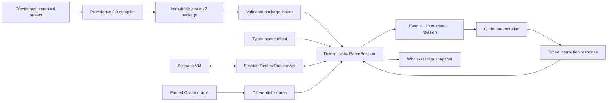

# Architecture

Realmz Remake 2.0 is a deterministic Realmz engine hosted by Godot, not a Godot-shaped RPG framework. Providence compiles canonical authoring projects into immutable packages. The runtime validates a package, constructs typed Realmz content, and gives one `GameSession` complete ownership of mutable playthrough state.

## Layer ownership

`src/core` owns direct Realmz models, fixed Classic rules, topology, clock, RNG, and the session aggregate. It is pure typed GDScript: no Nodes, scenes, autoloads, time, files, audio, OS calls, or Godot RNG.

`src/scenario` owns the serializable VM and Scenario Action language. It asks a session-owned `RealmzRuntimeApi` for domain operations. The VM cannot discover Godot or call arbitrary scripts.

`src/infrastructure` owns untrusted package/save bytes, schema and hash validation, typed construction, persistence, migrations, and installed-content discovery.

`src/app` constructs dependencies and translates host operations. It may replace a session only after a complete restore has validated.

The host materializes one detached `GameView` for a committed session revision and shares it across input gating and presenters. A map view contains the party-local 25×25 render projection, complete visited coordinates for the minimap, and cardinal movement results from topology; it does not rebuild all 8,100 cells of a Classic map for every key event.

`src/presentation` reads `GameView` and ordered domain events, renders disposable caches, and sends typed intents/responses. Animation never controls simulation timing.

## Session boundary

The public session protocol is:

- `start(content, seed) -> SessionStep`
- `restore(content, save_envelope) -> SessionStep`
- `submit_intent(player_intent) -> SessionStep`
- `respond(interaction_response) -> SessionStep`
- `view() -> GameView`
- `snapshot() -> SaveEnvelope`

Mutations are synchronous. A step contains committed ordered events, an optional serializable interaction request, a view revision, and an explicit completed/waiting/failed state. Presentation waits for animations on its own; the session waits only for genuine player or operating-system input.

## Fixed rules and direct model

The engine models Realmz concepts—party, characters, maps, APs/XAPs, Simple/Complex/Thief/Timed Encounters, battles, shops, treasures, spells, items, monsters, races, and castes—rather than translating them into generic RPG resources. Mutable state directly represents conditions, equipment and charges, pooled/banked wealth, allies, encounter attempts, shops, combatants, and program replacement. `RealmzRules` is always present and has no provider registry or compatibility selector. Its character, condition/time, inventory/economy, combat, magic, and monster modules are fixed collaborators, not swappable providers. A narrow named legacy quirk exists only when authored content demonstrably needs it.

## Topology

`MapTopology` and `WorldState` overlays are authoritative. Providence normalizes land cells, packed dungeon fields, Layout adjacency, and placed AP post-action destinations into cells with explicit directional edges/features, random regions, transitions, and validated map coordinates. Movement, LOS, deterministic pathfinding, searches, triggers, random encounters, AP destination rechecks, battle-terrain derivation, minimaps, 2D views, and the optional dungeon 3D view ask that same query surface. TileMaps, collisions, AStar graphs, textures, and meshes are presentation caches and cannot answer simulation questions. See `docs/topology-evidence.md` for the Castle evidence boundary and Phase 2 proofs.

Combat navigation stays inside the pure rules layer as a packed deterministic grid search. The active `BattlefieldState` remains authoritative and exposes only a nonserialized terrain revision for cache invalidation. `BattlefieldRules` derives four footprint-specific profiles containing static passability and exact maximum destination terrain charge, then reuses generation-tagged typed search storage across route decisions. Party Auto and monsters plan toward every legal hostile contact anchor before committing a step; current occupants constrain that first step, with a five-point edge for a rules-legal size-zero friendly swap, while later mobile occupancy is forecast. Castle's bounded random shift is only the no-route fallback. A tool-only weighted `AStarGrid2D` implementation measures the engine alternative but is not runtime infrastructure because it cannot own serialization, tie-breaking, legal contact goals, or the authoritative multi-cell cost contract.

Classic land presentation uses the package atlas at its native 32×32 cell size. A Classic negative land value is compiled as the landlook base tile plus an optional content-addressed `cicn` image; presentation draws that image above the base without creating a second terrain model. Normal play does not overlay topology edges, random rectangles, AP markers, or debug grids on that art. Small cardinal cues expose the already-computed topology answer, and keyboard or map click/hold input becomes the same typed movement intent.

## Scenario execution

Classic instructions retain raw/normalized opcode identity, slot, ID, and provenance. Triggers reference ordinary programs whose instructions are either preserved `ClassicAction` records or typed `CallScenarioAction` records. Negative Classic opcodes retain GOSUB intent; CODE 111 returns through the saved Classic frame, CODE 112 discards one, and opcode 39 replaces execution with an XAP program.

Safe Scenario Actions compile in Providence to bounded bytecode. They use separate Safe frames, typed arguments, explicit caller contexts and capabilities, and versioned optional persistent state, but execute inside the same serializable VM. A domain operation goes through the one `RealmzRuntimeApi` owned by `GameSession`; that public boundary delegates to typed character, combat, control-flow, and inventory executors while older domains are extracted incrementally. A genuine player decision yields a serializable request and resumes the exact issuing frame after a matching typed response. Battle-round and monster-death macros use nested serializable frames, with death macros completing before allegiance and outcome resolution; Castle's post-battle body-count choice rebuilds the held-over ally list before exact battle-owned fumbles are prepended to the same ordinary booty continuation, then the issuing frame resumes. Program replacement is a save-owned mapping resolved once when a VM frame starts; it never rewrites package content. Core `realmz.*` operations cannot be overridden, package actions are namespaced, and unknown behavior fails explicitly. GDScript is not a fallback; packages requiring it are rejected until an OS-confined external process implements the same JSON-safe Scenario Action ABI. See `docs/scenario-vm-evidence.md` and `docs/gameplay-domain-evidence.md`.

## Persistence and randomness

One `.r2save` envelope contains all mutable session state, including overlays, clock, equipment escrow, wealth, allies, encounter attempts/type flags, base-shop quantities and native-slot buyback stock, combat active-turn facts and exact fumbled item instances, scenario-program replacements, VM frames, VM or session-owned pending interaction, post-move/random-region/AP-destination, direct combat-death-macro, carried-item drop, post-battle ally-selection, or fumble-recovery continuation, action state, and RNG state/draw count. Installed package content is referenced by package hash and never copied into the save.

Every gameplay draw uses `RealmzRng`. It owns the QuickDraw `randSeed = randSeed * 16807 mod 2147483647` transition, signed low-word return (mapping `0x8000` to zero), Castle's inclusive `1 + abs(raw) * range / 32768` scaling, draw count, and semantic trace. Presentation has a separate cosmetic RNG. Oracle tests may inject raw scripted values so Castle and the new runtime take identical branches. See `docs/rng-evidence.md` for the evidence boundary.

## Classic-wide application presentation

The application uses one scene-backed `ClassicApplicationShell` and `ClassicScreenRouter` while the session protocol above remains unchanged. The shell owns the compact menu strip, dominant map/picture stage, right six-character roster, bottom narrative/status well, contextual bitmap command deck, campaign/setup surfaces, and Back behavior. Compact, Standard, and Wide profiles derive from effective available width; interface density and text scale remain independent. `UiRouteCatalog` is the sole route/shortcut/scene registry, and `ClassicCommandCatalog` is the sole contextual command registry. Rebuilt also owns one pinned stock Realmz application library containing the rules records, strings, fonts, controls, and integrated media that shipped with Realmz. Campaign packages contain only scenario-owned content and normalized stock references; package decoding composes those two authorities before constructing immutable content. See `docs/ui-strategy.md`, ADR 0010, and ADR 0014.

The dedicated `InteractionPresenter` delegates text/choice, selection, encounter, shop, temple, bank, and battle requests to typed components placed in either the textbox or stage region. Each component emits only the selected payload; the presenter preserves request identity and the application calls `GameSession.respond`. Each route owns a scene-backed clipped scroll surface so long content remains reachable at larger text scales.

The party-setup view is campaign-aware. It presents the authored campaign title/version/author and restriction summary from package v3, replaces assembly with one full-stage creator workspace, places Race on the left, prioritizes compatible named Castes on the right from typed eligibility relationships, and exposes Identity, Race & Caste, Appearance, Review, and Spells. Appearance identities are package data, and a missing catalog entry is an explicit unavailable choice rather than a guessed path. Starting Spells shares the ordinary spellbook's level/list/detail chrome while retaining its distinct typed multi-selection contract.

Reusable characters are separate from campaign saves. `CharacterVaultRepository` owns immutable `.r2char` revisions and recovery, while `GameSession` validates and clones a selected revision through `IMPORT_VAULT_CHARACTER`. Publishing is explicit and only occurs at a committed boundary. The vault cannot mutate an active session or silently rewrite a character from another campaign.

The old dashboard composition and procedural shell presenter have been removed. All nine workspaces provide nominal and honest empty/unavailable surfaces in the Classic-wide material system. Original controls and integrated Classic sounds come through app-owned exact-commit catalogs. Scenario media remains typed separately; the composed presentation catalog resolves an exact scenario key before an application fallback and never collapses CICN, ICON, PICT, or `snd ` identity to a bare number. Gameplay operations that do not yet have a session implementation remain disabled with explicit reasons; presentation does not fabricate service availability, tactical positions, journal entries, or hidden item facts.
