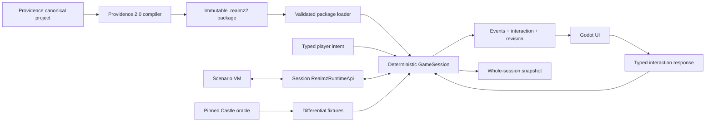

# The Realmz Rebuilt Builder's Manual

Welcome, builder. This volume is a map of the works: where the rules are kept, where a scenario enters the engine, where a character lives, and where Godot paints the visible game. You need not memorize the whole keep before changing one room. Begin with the landmark nearest your task, follow typed values across one boundary at a time, and let the verification gate warn you when a wall has been crossed.

Realmz Rebuilt is a deterministic Realmz engine hosted by Godot, not a collection of scenes that happen to resemble an RPG. Providence compiles authored adventures into immutable packages. Rebuilt validates one of those packages, constructs typed Realmz content, and gives one `GameSession` complete ownership of the mutable playthrough.



## A traveller's first map

If you seek a particular thing, begin here:

| You wish to change | First place to look |
|---|---|
| A character, economy, inventory, magic, combat, or world record | Its named feature root under `src/game`; use `src/game/shared` only for a genuinely cross-feature contract |
| A fixed calculation such as fatigue, movement, combat, equipment, or spell effects | The named feature root under `src/game` that owns the concept |
| What happens after a player command | `src/playthrough/session/game_session.gd`, then the named coordinator or workflow |
| A Classic opcode, AP/XAP, encounter, or Safe Scenario Action | `src/scenarios` |
| Package loading, saves, Character Files, or settings | `src/storage` |
| Startup, dependency wiring, and host input | `src/app` |
| A visible screen, dialog, HUD region, animation, or renderer | `src/ui` |
| Evidence for a Castle-visible behavior | `docs/*-evidence.md`, `docs/fidelity-ledger.md`, and `tests/fixtures/oracle` |

The names are part of the map. `Definition` means immutable authored content. `State` means mutable playthrough truth. `View` means a detached, read-only presentation record. `Rules` perform pure calculations. A `Repository` persists data; a `Loader` or `Decoder` admits external input; a `Controller` binds a screen; a `Renderer` draws custom visuals. `Classic` is reserved for something demonstrably inherited from Castle Realmz, not used as a synonym for “old” or “important.”

The active `RealmzContent` is a directory, not a universal catalog clerk. Its `scenario_records`, `characters`, `items`, `magic`, `combat`, and `economy` properties lead to the feature catalog that owns the lookup. Thus a portable item resolves as `content.items.item_by_id(...)`, while a battle resolves as `content.combat.battle_by_id(...)`. Package assembly has already applied the legal scenario overlay before these immutable catalogs are built; gameplay never guesses whether an application or scenario supplied the winning definition.

## The six halls

`src/game` owns direct Realmz models, fixed Classic rules, topology, clock, RNG, and detached read-model contracts. It is pure typed GDScript: no Nodes, scenes, autoloads, time, files, audio, OS calls, or Godot RNG.

`src/scenarios` owns four recognizable execution systems: `classic` for Castle opcodes and their source-backed operations, `actions` for Safe Scenario Action evaluation and state, `runtime` for the session-owned operation API and continuations, and `vm` for scheduling and serializable frames. The VM cannot discover Godot or call arbitrary scripts.

`src/storage` owns untrusted package/save bytes, schema and hash validation, typed construction, persistence, migrations, and installed-content discovery.

`src/playthrough` owns the command transaction. `GameSession` accepts typed player intent, coordinates rules and scenario execution, records committed events, and returns the next detached view or interaction. `SessionContext` carries the one live set of collaborators, while coordinators describe their outcome through `SessionCoordinatorResult`; neither masquerades as the other. A workflow may be resumable, but none of this layer owns a Godot node.

`src/app` constructs dependencies and translates host operations. It may replace a session only after a complete restore has validated. It is the composition root, not a second rules engine.

The host materializes one detached `GameView` for a committed session revision and shares it across input gating and presenters. A map view contains the party-local 25×25 render projection, complete visited coordinates for the minimap, and cardinal movement results from topology; it does not rebuild all 8,100 cells of a Classic map for every key event.

`src/ui` owns Godot scenes and controls. It reads `GameView` and ordered domain events, renders disposable caches, and sends typed intents/responses. Animation never controls simulation timing.

Dependencies point inward. `game` knows none of the other halls. `scenarios` builds on `game`; `playthrough` coordinates both; `storage` converts external bytes into their types; `ui` displays detached values; `app` assembles the complete application. If a low-level file must preload a high-level screen to do its work, the rooms have likely been joined in the wrong direction.

## Following one command

Suppose the player presses an arrow key. `src/app/composition/realmz_application.gd` asks `ExplorationIntents` for a typed `PlayerIntent`. `GameSession.submit_intent` routes it to the world workflow. Pure movement and topology rules decide whether the step is legal, scenario execution handles any reached trigger, and the playthrough commits ordered events. The application then requests a fresh `GameView`. `GameShell`, `ScreenNavigator`, and the map presenter render that view; they never decide whether the move was legal.

The same trail applies elsewhere:

```text
input -> feature intent factory -> PlayerIntent -> GameSession -> coordinator/workflow -> rules or ScenarioVm
      -> committed SessionStep -> GameView -> screen/controller/renderer
```

When a true decision is required, the session returns a serializable `InteractionRequest`. UI components display only its supplied options and return a typed `InteractionResponse`; the issuing workflow resumes through its feature under `src/playthrough`. Character, combat, economy, and scenario request bodies live beside their pure model under `src/game`, while the shared envelopes, neutral dialog and selection bodies, and strict record decoders live under `src/game/shared/interactions`. A maintainer can therefore follow one decision from model to workflow without searching a universal codec. `SessionContinuation` is only the stable saved envelope, while `SessionContinuationCodec` rejects unknown or mismatched payloads before restore. This is why a save can safely be made during a question, target picker, encounter, or other supported continuation.

## Session boundary

The public session protocol is:

- `start(content, seed) -> SessionStep`
- `restore(content, save_envelope) -> SessionStep`
- `submit_intent(player_intent) -> SessionStep`
- `respond(interaction_response) -> SessionStep`
- `view() -> GameView`
- `snapshot() -> SaveEnvelope`

Mutations are synchronous. A step contains committed ordered events, an optional serializable interaction request, a view revision, and an explicit completed/waiting/failed state. Presentation waits for animations on its own; the session waits only for genuine player or operating-system input.

## Fixed rules and direct model

The engine models Realmz concepts—party, characters, maps, APs/XAPs, Simple/Complex/Thief/Timed Encounters, battles, shops, treasures, spells, items, monsters, races, and castes—rather than translating them into generic RPG resources. Mutable state directly represents conditions, equipment and charges, pooled/banked wealth, allies, encounter attempts, shops, combatants, and program replacement. `RealmzRules` is always present and has no provider registry or compatibility selector. Its character, condition/time, inventory, equipment, economy, combat, magic, and monster modules are fixed collaborators, not swappable providers. `InventoryRules` owns carried-item and charge transactions; `EquipmentRules` owns wearable admission and combat loadouts. A narrow named legacy quirk exists only when authored content demonstrably needs it.

There is no single “character class file” that defines a whole adventurer. Immutable records describe races, castes, spells, and items; `CharacterState` owns one character's changing stamina, spell points, inventory, conditions, appearance, and lifetime record; `CharacterView` is the detached copy presented to Godot. Those character owners now live together in `src/game/characters`. `CasteDefinition` names its attribute constraints and level progression separately, so a reader can follow either concern without decoding the flat Providence record or its old 35-argument constructor. Search by the concept and suffix together—such as `CharacterState`, `CasteDefinition`, or `CharacterView`—rather than looking for one generic character script.

Money and location services follow the same map. `src/game/economy` contains the authored shop record, mutable wealth and service state, pure Economy and Temple rules, detached service views, and the flat-save codec. Begin with `GameState.location_services` when tracing whether a Shop, Temple, or Bank is available; scenario operations and playthrough workflows call that owner directly instead of asking `GameState` to impersonate the whole feature.

## Topology

`MapTopology` and the three save-owned world collaborators are authoritative. `WorldTopologyState` records physical and appearance changes, `WorldTriggerState` records AP and random-region changes, and `WorldExplorationState` records what the party has seen, visited, mapped, or noted; `WorldState` simply keeps them together for one save. Providence normalizes land cells, packed dungeon fields, Layout adjacency, and placed AP post-action destinations into cells with explicit directional edges/features, random regions, transitions, and validated map coordinates. Movement, LOS, deterministic pathfinding, searches, triggers, random encounters, AP destination rechecks, battle-terrain derivation, minimaps, 2D views, and the optional dungeon 3D view ask those same direct owners. TileMaps, collisions, AStar graphs, textures, and meshes are presentation caches and cannot answer simulation questions. See `docs/topology-evidence.md` for the Castle evidence boundary and Phase 2 proofs.

Combat navigation stays inside the pure rules layer as a packed deterministic grid search. The active `BattlefieldState` remains authoritative and exposes only a nonserialized terrain revision for cache invalidation. `BattlefieldRules` derives four footprint-specific profiles containing static passability and exact maximum destination terrain charge, then reuses generation-tagged typed search storage across route decisions. Party Auto first preserves Castle's signed direct pursuit step and swaps through a same-side size-zero actor on that square for five movement; otherwise Party Auto and monsters plan toward every legal hostile contact anchor. Current occupants constrain the first planned step, with a five-point edge for a rules-legal size-zero friendly swap, while later mobile occupancy is forecast. Castle's bounded random shift is only the no-route fallback. A tool-only weighted `AStarGrid2D` implementation measures the engine alternative but is not runtime storage because it cannot own serialization, tie-breaking, legal contact goals, or the authoritative multi-cell cost contract.

Classic land presentation uses the package atlas at its native 32×32 cell size. A Classic negative land value is compiled as the landlook base tile plus an optional content-addressed `cicn` image; presentation draws that image above the base without creating a second terrain model. Normal play does not overlay topology edges, random rectangles, AP markers, or debug grids on that art. Small cardinal cues expose the already-computed topology answer, and keyboard or map click/hold input becomes the same typed movement intent.

## Scenario execution

Classic instructions retain raw/normalized opcode identity, slot, ID, and provenance. Triggers reference ordinary programs whose instructions are either preserved `ClassicAction` records or typed `CallScenarioAction` records. Negative Classic opcodes retain GOSUB intent; CODE 111 returns through the saved Classic frame, CODE 112 discards one, and opcode 39 replaces execution with an XAP program.

Scenario rules are deliberately divided. Compiled scenario-owned facts enter through `src/storage/packages`; runtime programs and opcode meanings live under `src/scenarios`; reusable gameplay consequences are requested through the narrow runtime API and committed by `src/playthrough`; universal calculations live with the feature they govern under `src/game`. A scenario package may supply data and invoke supported behavior, but it may not smuggle arbitrary GDScript into the simulation.

Every running VM frame carries a typed `ScenarioExecutionContext` describing only its trigger, encounter, application, combat, and program-transfer provenance. Follow that value when you need to know why an opcode is executing. Its sparse save dictionary is handled only by `ScenarioExecutionContextCodec`; runtime code never fishes provenance out of an arbitrary dictionary.

Safe Scenario Actions compile in Providence to bounded bytecode. They use separate Safe frames, typed arguments, explicit caller contexts and capabilities, and versioned optional persistent state, but execute inside the same serializable VM. A domain operation goes through the one `RealmzRuntimeApi` owned by `GameSession`; that public boundary delegates to typed character, combat, control-flow, and inventory executors while older domains are extracted incrementally. A genuine player decision yields a serializable request and resumes the exact issuing frame through the interaction, age, service, combat, or reward factory under `src/scenarios/runtime/continuations`; the envelope owns identity while the strict codec owns saved dictionaries. Battle-round and monster-death macros use nested serializable frames, with death macros completing before allegiance and outcome resolution; Castle's post-battle body-count choice rebuilds the held-over ally list before exact battle-owned fumbles are prepended to the same ordinary booty continuation, then the issuing frame resumes. Program replacement is a save-owned mapping resolved once when a VM frame starts; it never rewrites package content. Core `realmz.*` operations cannot be overridden, package actions are namespaced, and unknown behavior fails explicitly. GDScript is not a fallback; packages requiring it are rejected until an OS-confined external process implements the same JSON-safe Scenario Action ABI. See `docs/scenario-vm-evidence.md` and `docs/gameplay-domain-evidence.md`.

## Persistence and randomness

One `.r2save` envelope contains all mutable session state, including overlays, clock, equipment escrow, wealth, allies, encounter attempts/type flags, base-shop quantities and native-slot buyback stock, combat active-turn facts and exact fumbled item instances, scenario-program replacements, VM frames, VM or session-owned pending interaction, post-move/random-region/AP-destination, direct combat-death-macro, carried-item drop, post-battle ally-selection, or fumble-recovery continuation, action state, and RNG state/draw count. Installed package content is referenced by package hash and never copied into the save.

Every gameplay draw uses `RealmzRng`. It owns the QuickDraw `randSeed = randSeed * 16807 mod 2147483647` transition, signed low-word return (mapping `0x8000` to zero), Castle's inclusive `1 + abs(raw) * range / 32768` scaling, draw count, and semantic trace. Presentation has a separate cosmetic RNG. Oracle tests may inject raw scripted values so Castle and the new runtime take identical branches. See `docs/rng-evidence.md` for the evidence boundary.

## Godot's visible rooms

The application uses one scene-backed `GameShell` and `ScreenNavigator` while the session protocol above remains unchanged. Open `src/ui/shell/game_shell.tscn` to see the persistent menu, map/picture stage, six-character roster, narrative/status well, and contextual command regions. Workspace scenes live with their feature under `src/ui`; stable panels belong in those `.tscn` files, while their controllers bind detached data and create only genuinely variable rows or records.

The scenes under `src/ui/characters`, `inventory`, `magic`, `services`, `journal`, `setup`, and `shell` expose the complete stable hierarchy for Inventory, Character, Allies, Bestiary, Maps/Notes, Money and services, Spells, System, Character Files, and campaign setup. Open the Realmz Builder dock to bind the same production controllers to Wide, Compact, Empty, Long Content, Unavailable, or Error preview data without saving preview children into the scene. Exploration and Combat are typed modes of the persistent shell rather than misleading one-node workspace scenes.

The persistent shell follows the same rule at a larger scale. `game_shell.tscn` owns the visible stage, roster, narrative well, and command regions; `GameShell` coordinates them; `GameShellMenuController` owns menu population and dispatch; and `GameShellCommandController` owns contextual command availability and held-button presentation. Above the shell, `PresentationCoordinator` applies detached views and playback while `PresentationMediaController` composes the effective Classic media and music context. None of those classes decides whether a command is legal in Realmz—the detached view reports that fact, and `GameSession` remains the mutation boundary.

Custom maps, battlefields, dungeon projection, animations, and effects may remain code-driven where algorithms are clearer than node trees. Ordinary forms, fixed panels, button rails, and inspectors belong in scenes. Repeated structures should become small `PackedScene` rows rather than long chains of `Control.new()` calls.

Compact, Standard, and Wide profiles derive from effective available width; interface density and text scale remain independent. `UiRouteCatalog` is the sole route/shortcut/scene registry, and the Classic command catalog is the contextual command registry. Rebuilt also owns one pinned stock Realmz application library containing the rules records, strings, fonts, controls, and integrated media that shipped with Realmz. Campaign packages contain only scenario-owned content and normalized stock references; package decoding composes those two authorities before constructing immutable content. See `docs/ui-strategy.md`, ADR 0010, and ADR 0014.

The dedicated `InteractionPresenter` delegates text/choice, selection, encounter, shop, temple, bank, and battle requests to typed components placed in either the textbox or stage region. Each component emits only the selected payload; the presenter preserves request identity and the application calls `GameSession.respond`. Each route owns a scene-backed clipped scroll surface so long content remains reachable at larger text scales.

The party-setup view is campaign-aware. It presents the authored campaign title/version/author and restriction summary from package v3, replaces assembly with one full-stage creator workspace, places Race on the left, prioritizes compatible named Castes on the right from typed eligibility relationships, and exposes Identity, Race & Caste, Appearance, Review, and Spells. Appearance identities are package data, and a missing catalog entry is an explicit unavailable choice rather than a guessed path. Starting Spells shares the ordinary spellbook's level/list/detail chrome while retaining its distinct typed multi-selection contract.

Reusable characters are separate from campaign saves. `CharacterVaultRepository` owns immutable `.r2char` revisions and recovery, while `GameSession` validates and clones a selected revision through `IMPORT_VAULT_CHARACTER`. Publishing is explicit and only occurs at a committed boundary. The vault cannot mutate an active session or silently rewrite a character from another campaign.

Every route provides nominal and honest empty/unavailable surfaces in the Classic-wide material system. Original controls and integrated Classic sounds come through app-owned exact-commit catalogs. Scenario media remains typed separately; the composed presentation catalog resolves an exact scenario key before an application fallback and never collapses CICN, ICON, PICT, or `snd ` identity to a bare number. Gameplay operations that do not yet have a session implementation remain disabled with explicit reasons; presentation does not fabricate service availability, tactical positions, journal entries, or hidden item facts.

## Working without waking the dragons

Make one coherent change at a time. Read the feature's local `README.md`, its guide under `docs/features`, and its entry in `docs/system-manifest.json`; preserve serialized names unless a migration is explicitly designed, and keep the game runnable after every commit. Add behavior-focused tests at the boundary that owns the fact; do not test a private helper merely because it is nearby.

For a normal source change, run the narrow affected suite while iterating and finish with:

```powershell
./tools/verify.ps1
```

The verification gates are ratchets, not scores to game. The older maintainability inventory prevents new unreviewed `Control.new()` calls while the stricter overhaul gate drives stable-layout construction, one-node markers, generic aliases, cross-object private calls, and size hot spots to their final limits. When a collection varies, export and instantiate a reusable row scene. When topology truly determines rendering geometry, keep that algorithm in its named presenter and author the surrounding viewport and controls in a scene.

## Before leaving the workshop

A newcomer should be able to answer five questions from names and nearby documentation alone: Who owns this truth? Is it immutable content or mutable state? Which typed command changes it? Which detached view displays it? Which test proves the contract? If any answer requires folklore, improve the name, the boundary, or this manual before adding another passageway.

The public [New Builder's Trial](maintainer-acceptance.md) turns that promise into six reproducible journeys through movement fatigue, character state, portable items, scenario instructions, Inventory authoring, and combat Auto. Run it against a clean candidate checkout with a contributor who has not learned the answers privately; treat every misleading turn as a repair request, not as a failing of the traveller.
